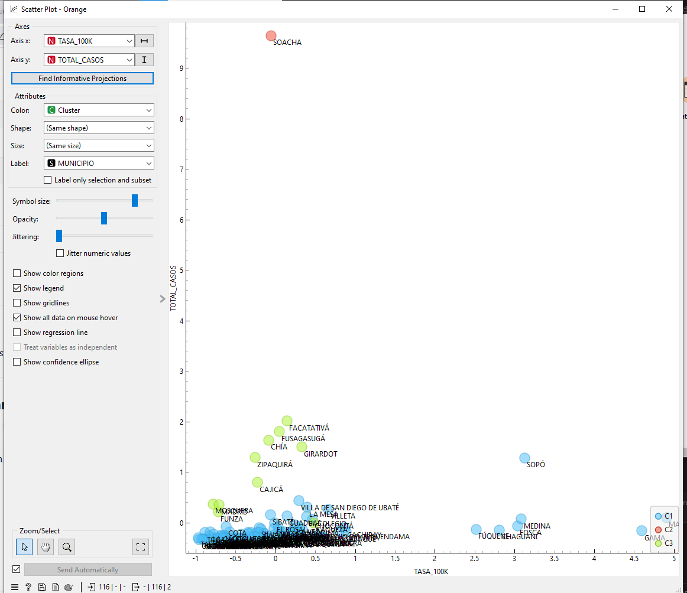
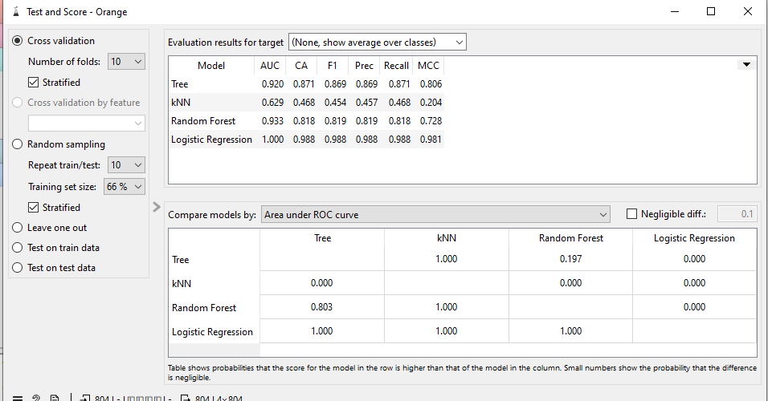
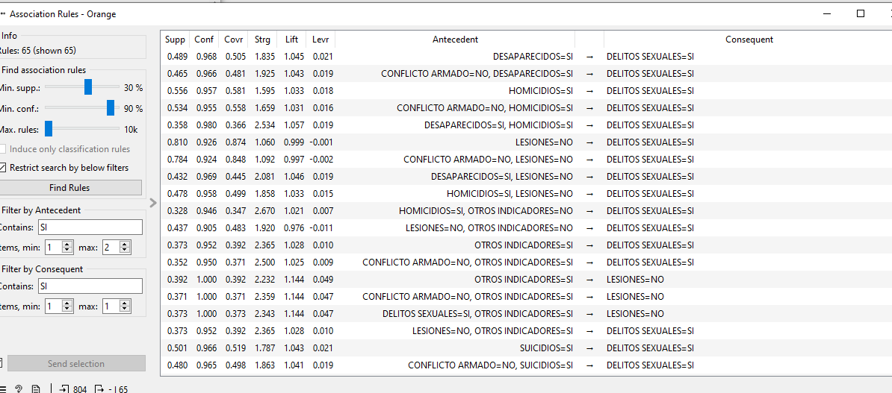

# Seguridad Ciudadana en Cundinamarca

Dashboard analítico sobre indicadores de seguridad ciudadana en los municipios de Cundinamarca (Colombia), construido en cuatro niveles de conocimiento: **evidente** (dashboard descriptivo), **multidimensional** (modelo estrella + Power BI), **oculto** (minería de datos con Orange) y **profundo** (procesamiento distribuido y Machine Learning con PySpark/MLlib).

> **English summary:** A Flask dashboard analyzing citizen-security indicators across the municipalities of Cundinamarca, Colombia. It layers four levels of analysis on top of the same dataset: a descriptive Power BI dashboard, data mining with Orange (clustering, classification, association rules), and a distributed processing/ML pipeline with PySpark and MLlib. See below for setup, architecture, and how to reproduce the PySpark pipeline.

## Capturas

**Minería de datos con Orange — clustering de municipios**



**Clasificación del nivel de riesgo**



**Reglas de asociación**



## Los 4 niveles de conocimiento

| Nivel | Herramienta | Resultado | Ruta |
|---|---|---|---|
| Evidente | Dashboard descriptivo | Totales e indicadores generales | `/` |
| Multidimensional | Modelo estrella + Power BI | Análisis por municipio, año, indicador, categoría y fuente | `/` |
| Oculto | Orange Data Mining | Clustering, clasificación y reglas de asociación | `/mineria` |
| Profundo | PySpark + MLlib | Procesamiento distribuido, consultas analíticas y KMeans | `/pyspark` |

## Stack técnico

- **Backend:** Flask (Python), lectura de CSV con la librería estándar (`csv`, `pathlib`).
- **Frontend:** Jinja2 (templates con herencia vía `base.html`), CSS propio, Chart.js para las gráficas interactivas de `/pyspark`.
- **Visualización multidimensional:** Power BI (embebido vía iframe con URL "publish to web").
- **Minería de datos:** Orange Data Mining (clustering k-Means, clasificación con Logistic Regression/Random Forest/kNN/árbol de decisión, reglas de asociación).
- **Procesamiento distribuido / ML:** PySpark (`pyspark.sql`, `pyspark.ml`) — agrupaciones, KMeans y evaluación con `ClusteringEvaluator`.
- **Servidor de producción:** Gunicorn (ver `Procfile`).
- **Tests:** Pytest sobre el cliente de pruebas de Flask.

## Estructura del proyecto

```
.
├── app.py                     # Aplicación Flask: rutas, lectura de CSV, helpers de formato
├── pyspark_analysis.py        # Script batch: genera data/*_pyspark.csv con PySpark + MLlib
├── requirements.txt           # Dependencias de producción
├── requirements-dev.txt       # + dependencias de test (pytest)
├── Procfile                   # Comando de arranque para Render/Heroku/Railway (gunicorn)
├── data/
│   ├── seguridad_clean.csv    # Dataset base (Observatorio de Seguridad y Convivencia)
│   └── *_pyspark.csv          # Salidas generadas por pyspark_analysis.py
├── templates/
│   ├── base.html              # Layout compartido (head, header, footer)
│   ├── index.html             # Dashboard Power BI
│   ├── mineria.html           # Resultados de Orange Data Mining
│   └── pyspark.html           # Resultados de PySpark + gráficas Chart.js
├── static/
│   ├── style.css
│   └── img/                   # Capturas de Orange usadas en mineria.html
└── tests/
    └── test_app.py
```

## Instalación y ejecución local

Requiere Python 3.10–3.12 (PySpark aún no soporta versiones más recientes de Python de forma estable).

```bash
python -m venv .venv
source .venv/bin/activate        # Windows: .venv\Scripts\activate

pip install -r requirements.txt
python app.py                    # http://localhost:5000
```

Variables de entorno opcionales:

| Variable | Descripción | Default |
|---|---|---|
| `POWERBI_URL` | URL "publish to web" del dashboard de Power BI a embeber | URL del dashboard del proyecto |
| `PORT` | Puerto en el que arranca el servidor | `5000` |
| `FLASK_DEBUG` | Activa el modo debug de Flask (`true`/`false`) | `false` |

## Regenerar los datos de PySpark

Las tablas y gráficas de `/pyspark` se leen de los CSV en `data/`, generados por `pyspark_analysis.py`. Para regenerarlos (requiere Java instalado, dependencia de PySpark):

```bash
python pyspark_analysis.py --escenario "Local master" --factor 50 --master "local[4]"
```

- `--factor` amplía artificialmente el dataset (vía `crossJoin`) para simular un volumen mayor y comparar tiempos de Pandas vs. Spark.
- `--master` controla el nivel de paralelismo local (`local[1]`, `local[2]`, `local[4]`, `local[*]`).
- Cada ejecución agrega/actualiza una fila en `data/tiempos_pyspark.csv` (identificada por `--escenario`), lo que permite comparar varios escenarios en la tabla de `/pyspark`.

## Tests

```bash
pip install -r requirements-dev.txt
pytest
```

Incluye pruebas de las rutas Flask y pruebas unitarias de los helpers de formato numérico (`convertir_numero`, `formatear_numero`), incluyendo un test de regresión que verifica que valores como `2114711.9` no se inflen a `21147119` por un parseo incorrecto de separadores decimales.

## Despliegue

El proyecto incluye un `Procfile` (`web: gunicorn app:app`), compatible con Render, Railway o Heroku. En esos entornos basta con configurar `POWERBI_URL` (opcional) como variable de entorno; el `PORT` normalmente lo inyecta la plataforma automáticamente.

## Fuente de datos

Datos abiertos de Seguridad Ciudadana (Observatorio de Seguridad y Convivencia), DIVIPOLA y proyecciones de población DANE.

## Licencia

Este proyecto está bajo la licencia MIT — ver [LICENSE](LICENSE).
